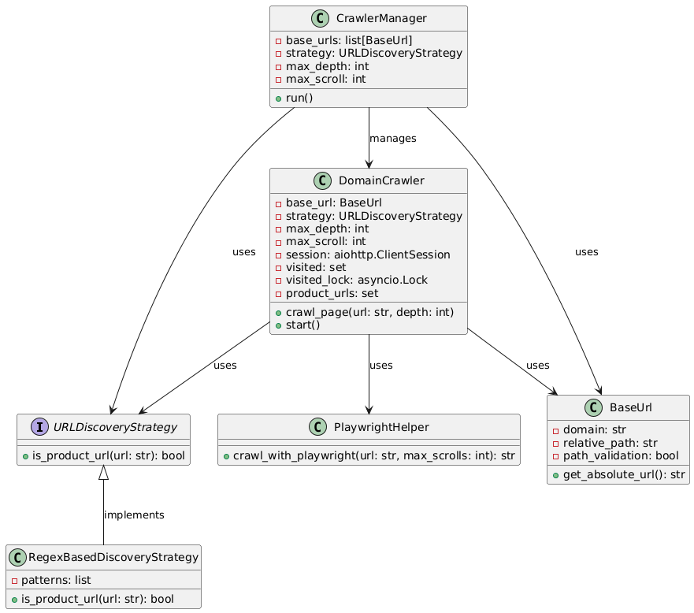

# webcrawler

## Overview

The **webcrawler** is a simple, high performant crawler written in python for crawling through the e commerce websites to get the product urls. This crawler provides a way to configure the strategy used to determine whether a given url is a product url. This handles the edge cases like infinite scrolls, variations in url structures, etc

## Requirements

- **Python:** Make sure Python is installed on your machine.

## Installation

To get started with the **web crawler**, follow these steps:

1. Move into the project folder.

2. Once you are in the `webcrawler` folder, run the following command:

```bash
pip3 install -r requirements.txt
```

3. You'll find all the required modules installed with this.

4. To run the tool, go into src folder and use the following command:


```bash
python3 main.py
```

## Code Coverage

This project has 100% code coverage. You can run the following command to check the coverage:

### Output

output goes into `output/product_urls.json`

## LLD Decisions

1. **Single Responsibility Principle:**  
   - **URLDiscoveryStrategy (Interface):** Handles the logic of determining whether a given URL qualifies as a product page. This class is solely responsible for URL filtering.  
   - **RegexBasedDiscoveryStrategy (Concrete Class):** Implements the filtering logic using regular expressions. It focuses on matching URL patterns and can be extended without affecting other parts of the system.  
   - **DomainCrawler:** Responsible for crawling a single domain or base URL (with an optional relative path). It handles fetching pages, parsing HTML content, filtering links using the injected strategy, and managing the crawl depth. Importantly, it performs asynchronous crawling within the same site—processing multiple pages concurrently via a recursive asynchronous approach. Additionally, it uses Playwright to simulate infinite scrolling for pages that load content dynamically.  
   - **CrawlerManager:** Manages multiple `DomainCrawler` instances concurrently. It orchestrates the overall crawling process across various domains (or base URLs) and aggregates the results.  
   - **Main Function:** Acts as the entry point, setting up configurations (such as the list of base URLs—which include domains and optional paths—and URL patterns), instantiating the necessary classes, and triggering the crawl process. Configurations are loaded from a YAML file.

2. **Open/Closed Principle:**  
   - The solution is designed to be open for extension but closed for modification. For instance, if a new URL discovery mechanism is needed, a new class implementing the `URLDiscoveryStrategy` interface can be created without altering the existing crawler code.

3. **Dependency Inversion Principle:**  
   - High-level modules such as `DomainCrawler` depend on the abstract `URLDiscoveryStrategy` rather than on a concrete implementation. This allows for the injection of different strategies (e.g., regex-based or even machine-learning based) without modifying the crawler’s core logic.

4. **Asynchronous and Scalable Design:**  
   - By using `aiohttp` and `asyncio`, the crawler fetches pages concurrently both across multiple domains and within the same domain. This asynchronous recursive approach (via `asyncio.gather`) enables high performance and scalability, especially when handling large websites or numerous base URLs. The use of Playwright for infinite scrolling further enhances the crawler's ability to handle dynamically loaded content.

5. **Working:**  
   - The crawler employs an asynchronous recursive approach to traverse pages. Starting from a specified base URL, it concurrently fetches and processes links within the same domain. A controlled maximum depth ensures that recursion stops at a predefined level, preventing infinite loops and excessive resource consumption. The use of Playwright allows the crawler to simulate user interactions such as scrolling, ensuring that all content is loaded before parsing.

## Class Diagram

